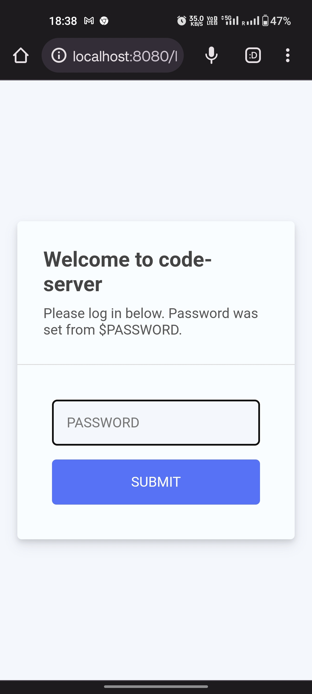
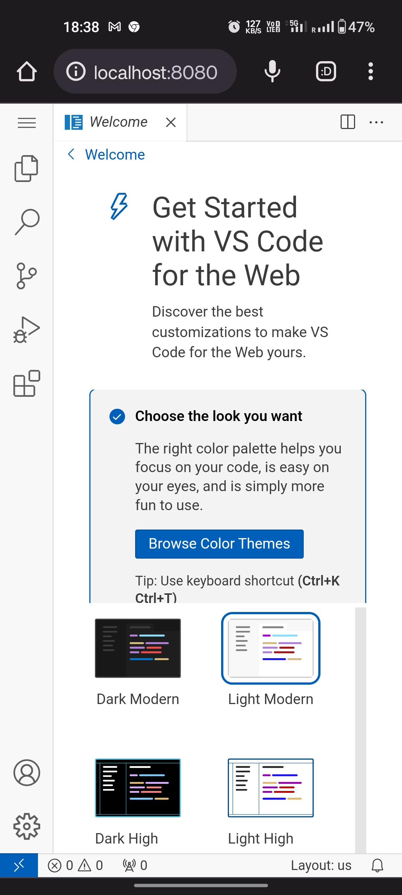

# Install VS Code on Android using Termux

Visual Studio Code (VS Code) is one of the most popular code editors, widely used for software development. While VS Code is officially available on desktops, you can also run it on an Android device using **Termux** and **Ubuntu (via proot-distro)**. This guide will walk you through the complete installation process.

## Step 1: Install Termux

To install VS Code, you first need to install the Termux app. Download the APK from the link below:

[Download Termux APK](https://www.mediafire.com/file/5ymzaglxnddir1c/Termuxcom.termuxv0.118.1.apk/file)

## Step 2: Install Ubuntu using Termux

### Update the package repository  
Open Termux and enter the following command:

```sh
pkg update
```

When prompted, press `y` and then press `Enter`. You will have to do this whenever prompted.

### Upgrade installed packages  
Run the following command:

```sh
pkg update -y
```

### Install proot-distro  
Install `proot-distro` using:

```sh
pkg install proot-distro
```

### (Optional) List available Linux distributions  
To see all available distributions you can install using proot, run:

```sh
proot-distro list
```

### Install Ubuntu  
Run the following command to install Ubuntu:

```sh
proot-distro install ubuntu
```

### Start Ubuntu  
Once the installation is complete, log into Ubuntu by running:

```sh
proot-distro login ubuntu
```

## Step 3: Download and Install Code Server

### Update package repository inside Ubuntu  
Run:

```sh
apt update
```

### Upgrade installed packages  
Run:

```sh
apt upgrade
```

Press `y` and `Enter` whenever prompted.

### Install wget  
To download the required files, install `wget`:

```sh
apt install wget
```

Press `y` and `Enter` to confirm installation.

### Download the latest Code Server release  
Run the command below to download Code Server:

```sh
wget https://github.com/coder/code-server/releases/download/v4.16.1/code-server-4.16.1-linux-arm64.tar.gz
```

### Extract the tarball  
Extract the downloaded file:

```sh
tar -xvf ./code-server-4.16.1-linux-arm64.tar.gz
```

### Navigate to the Code Server directory  
Move into the extracted folder:

```sh
cd code-server-4.16.1-linux-arm64
cd bin
```

## Step 4: Set Up a Password and Start Using VS Code

### Set up a password  
Run the following command:

```sh
export PASSWORD="password"
```

> **Note:** Use a strong password for security, especially if you plan to use Code Server remotely.

### Start the Code Server  
Launch VS Code by running:

```sh
./code-server
```

### Access VS Code in Your Browser  
Open **Google Chrome** (or any browser) and visit:

```
http://localhost:8080
```

You will see a login screen like this:



After entering your password, you will see the VS Code welcome screen:



---

## Troubleshooting & Caveats

### If `pkg update` doesn't work  
Try changing the repository using:

```sh
termux-change-repo
```

Select **Mirror by Grimler** and run `pkg update` again.

### Always confirm prompts  
When prompted, press `y` and then `Enter` to continue installation.

---

Hope this guide helps! If you have any questions or suggestions, feel free to comment. **Happy Coding!**
